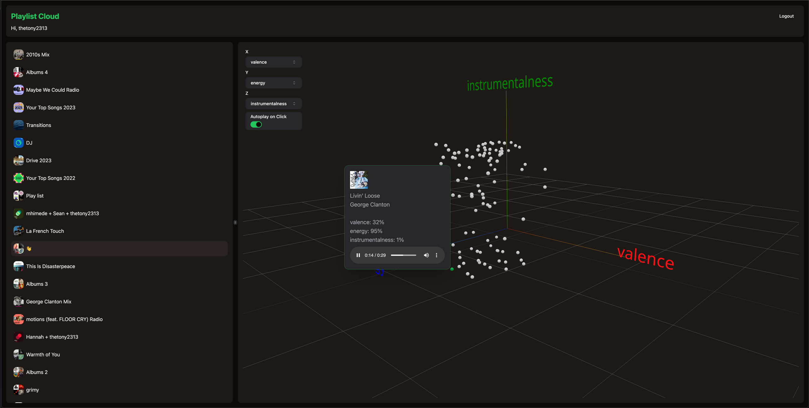

# Playlist Cloud Visualizer



> [!NOTE]
> The hosted version of Playlist Cloud is subject to an Allowlist for sign-ups. This is due to a restriction with the Spotify API for hobbyist apps 😅

## Features

- Visualize your Spotify playlists in 3D space
- Re-arrange the tracks in space to your liking, based on Spotify's audio analysis
- View track information on hover, or click
- Preview songs directly in the app

Future feature ideas:

- Split playlists into multiple smaller playlists based on cloud clusters
- Filter point cloud by track attributes
- Improve visuals and interactivity
- Pagination of playlists as well as tracks on a playlist
  - Currently, the app can handle up to 100 tracks in a playlist, and 100 playlists per user

## Development

Run the dev server:

```sh
pnpm install
cp .env.example .env
# edit .env with your Spotify API credentials
# get Spotify app credentials here: https://developer.spotify.com/dashboard/application
# Use the default callback URL inside of .env.example when configuring your Spotify app
pnpm run dev
```

## Deployment

First, build your app for production:

```sh
pnpm run build
```

Then run the app in production mode:

```sh
pnpm start
```
